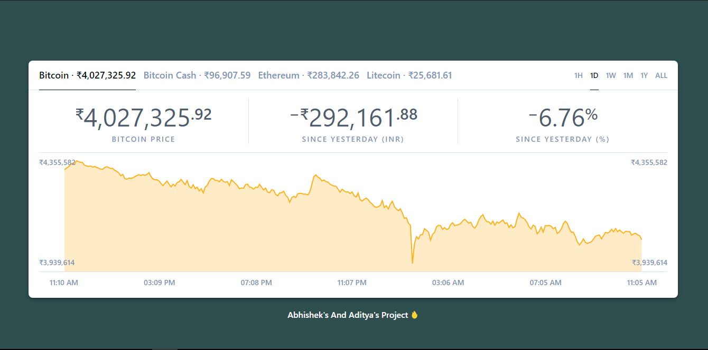

Project Url
```shell
https://crypto-charts.vercel.app/
```

## About

Coincharts is a cryptocurrency price chart based off [Coinbase](https://www.coinbase.com/)'s original price chart on [https://www.coinbase.com/charts](https://web.archive.org/web/20190331085909/https://www.coinbase.com/charts)

<p align="center">
  
</p>

* Bootstrapped with [create-react-app]

## Getting Started

#Install Dependencies
```shell
npm install
```

```shell
npm start
```

About The Project
The React App Fetches Coin Data from Coinbase Api 

```shell
https://www.coinbase.com/api/v2/prices/${cryptocurrency}-${currency}/historic?period=${durationType}
```

The App Creates A CRYPTOCURRENCY_LIST with the Key Value Pairs of The CryptoCurrency is has to Fetch Rates of

Currency is the Currency it has to Convert too
Other Currency Can also be Set As Default
```shell
export const CURRENCY = {
  CAD: { key: "CAD", name: "Canadian Dollar" },
  USD: { key: "USD", name: "US Dollar" },
  INR: { key: "INR", name: "Indian Ruppee" },
};
```

durationtype is the Time for which the charts are shown
```shell
export const DURATION = {
  HOUR: { key: "hour", codename: "1H", humanize: "past hour" },
  DAY: { key: "day", codename: "1D", humanize: "since yesterday" },
  WEEK: { key: "week", codename: "1W", humanize: "since last week" },
  MONTH: { key: "month", codename: "1M", humanize: "since last month" },
  YEAR: { key: "year", codename: "1Y", humanize: "since last year" },
  ALL: { key: "all", codename: "ALL", humanize: "" },
};
```
The App is Bootstrapped with [create-react-app]

The Price Table and Charts Are Rendered Using React , Basic Html and Css

## License

Coincharts is [MIT licensed](./LICENSE).
